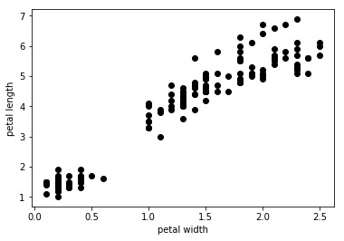
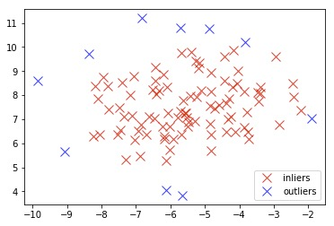

# 数据科学导论

## 新手上路
- **数据科学**：线性代数，统计模型，*可视化*，计算机语言，图形分析，机器学习，数据存储，商业智能，搜索。
ipython中的常用命令
```python
<object>? # 帮助信息
<object>?? # 详细帮助信息
%<function> # 魔术方程调用格式
%quickref # 快速查看帮助
!ls # 使用bash命令行
```

## 数据准备
也就是数据准备，或者数据整理
pandas 可以读取各种文件格式的数据
- pandas 读取的数据格式一些常用操作
```python
iris['target'].unique() # 显示去重后某列所有元素
iris.groupby(['target']).mean() # 按照某列group后的平均值
iris.sort_values(by='sepal_length') # 按照某列排序
```

- pandas数据类型取值是先row 再col
```python
iris.loc[13, 'sepal_length'] # 与ix等价
iris.loc[[9,10], [2,4]] 可以范围取值
```

- 多分类问题，需要将分类转为[0, 0 , 0 , ... , 1 ... , 0] 的数组
```python
categorical_feature = pd.Series(iris['target'].unique()) # 把类别编号为 0 ， 1， 2， 3 ...
mapping = pd.get_dummies(categorical_feature) # 转换为 [0, 0 , 0 , ... , 1 ... , 0] 的向量
```

- 词频统计
```python
from sklearn.feature_extraction.text import CountVectorizer
count_vect = CountVectorizer(ngram_range=(1,2)) # 输出unigram 和 bigram
word_count = count_vect.fit_transform(twenty_sci_news.data)
```

- tf-id 统计
```python
from sklearn.feature_extraction.text import TfidfVectorizer
tfidf_vect = TfidfVectorizer()
word_tfidf = tfidf_vect.fit_transform(twenty_sci_news.data)
```

### numpy
基本操作
```python
list_of_ints = [1,2,3，4]
Array_1 = Numpy.array(list_of_ints, dtype='int32') # 创建数组
Array_1.dtype # 数据类型
Array_1.nbytes # 数据占空间
Array_1.reshape(2,2) # 数据改格式 2行2列
Array_1.T # 矩阵转置
Numpy.dot(A,B) # AB矩阵相乘
```

## 数据科学流程
要了解一个数据集合的整体情况可以用
```python
iris.describe() # 显示个数平均值标准差 最大最小 中位数百分比等常见内容
iris.quantile([0.1, 0.9]) # 显示90% 10%数据
pd.crosstab(iris['petal_length'] > iris['petal_length'].mean(), iris['petal_width']>iris['petal_width'].mean()) # 显示两者相关性
```

- 几种matplotlib画图
``` python
iris.boxplot(return_type='axes') # 生成概述图
```


``` python
plt.scatter(iris['petal_width'], iris['petal_length'], alpha=1, color='k') # 散点图，alpha表示多少个点会彻底黑
```




``` python
plt.hist(iris['petal_width'], bins=20) # 直方图 bings是分快数
```


### 特征创建
StandardScaler 将数据转换到均值为0 方差为1的
```python
from sklearn.preprocessing import StandardScaler
scaler = StandardScaler()
x_train_scaled = scaler.fit_transform(x_train)
x_test_scaled = scaler.transform(x_test)
```
增加一维数据
```python
x_train_new_feat = np.sqrt(x_train[:, non_linear_feat]) # 新一维的数据
x_train_new_feat.shape = (x_train_new_feat.shape[0], 1) # x_train_new_feat.shape 从 (16512,) 变成 (16512, 1)
x_train_extended = np.hstack([x_train, x_train_new_feat])
```

### 降维
- 相关性分析
使用numpy中的可以查看各数据的相关性
```python
cov_data = np.corrcoef(iris.data.T)
```
- 各种降维方法，PCA 
```python
from sklearn.decomposition import PCA # 标准PCA
from sklearn.decomposition import RandomizedPCA # 随机PCA更快但是可能不是全局最优
from sklearn.lda import LDA # 线性分析
pca_2c =PCA(n_components=2) # 保留2维
x_pca_2c = pca_2c.fit_transform(iris.data) # 转换
pca_2c.explained_variance_ratio_.sum() # 保留的信息量
```

- 对于词向量
```python
from sklearn.feature_extraction.text import TfidfVectorizer 
tf_vect = TfidfVectorizer()
word_freq = tf_vect.fit_transform(twenty_sci_news.data)
from sklearn.decomposition import TruncatedSVD
tsvd_2c = TruncatedSVD(n_components=50)
tsvd_2c.fit(word_freq) 
```

- 对于非线性
```python
from sklearn.decomposition import KernelPCA # 核PCA
kpca_2c = KernelPCA(n_components=2, kernel='rbf')
x_kpca_2c = kpca_2c.fit_transform(fake_circular_data)
```

- 玻尔兹曼机
```python
from sklearn.neural_network import BernoulliRBM
```

### 奇异值处理
- 3 sigma 处理
```python
from sklearn import preprocessing
normalized_data = preprocessing.StandardScaler().fit_transform(boston.data[:, continuous_variables]) # 归一化处理
outliers_rows, outliers_columns = np.where(np.abs(normalized_data) >3) # 归一化后方差为1，所以大于3的就是3sigma外的点
```

- 多元高斯分布找异常值

```python
from sklearn.covariance import EllipticEnvelope
robust_convariance_est = EllipticEnvelope(contamination=.1).fit(blob[0]) # contamination后的0.1表示污染参数，正常情况污染参数应该为0.1
detection = robust_convariance_est.predict(blob[0]) # 是否污染点
outliers = np.where(detection ==-1)
inliers = np.where(detection ==1)
plt.plot(blob[0][:,0], blob[0][:,1], 'x', markersize=10, color='k', alpha=0.8) # '形状为x', markersize:x的大小
plt.show()
```


```python
a = plt.plot(blob[0][inliers, 0], blob[0][inliers, 1], 'x', markersize=10, color='r', alpha=0.8, label='inliers')
b = plt.plot(blob[0][outliers, 0], blob[0][outliers, 1], 'x', markersize=10, color='b', alpha=0.8, label='outliers')

plt.legend((a[0], b[0]), ('inliers', 'outliers'), numpoints=1, loc='lower right') # loc表示提示框的位置
plt.show()
```




使用PCA 探测奇异值
```python
from sklearn.decomposition import PCA
robost_covariance_est = EllipticEnvelope(store_precision=False, assume_centered = False, contamination=0.05)
robost_covariance_est.fit(normalized_data)
```

使用SVM 探测奇异值
```python
from sklearn import svm
outliers_fraction = 0.02
nu_estimate = 0.95*outliers_fraction + 0.05
machine_learning = svm.OneClassSVM(kernel="rbf", gamma=1.0/len(normalized_data), degree=3, nu=nu_estimate)
machine_learning.fit(normalized_data)
```

### 评分系统
- 混淆矩阵 
```python
from sklearn import metrics
from sklearn.metrics import confusion_matrix
cm = confusion_matrix(y_test, y_pred)
```
- 一些分数
```python
metrics.accuracy_score(y_test, y_pred) # 准确率
metrics.recall_score(y_test, y_pred) # 召回
metrics.precision_score(y_test, y_pred) # 准确率
metrics.f1_score(y_test, y_pred) # f1
```
- 生成报告
```python
from sklearn.metrics import classification_report
print(classification_report(y_test, y_pred, target_names=iris.target_names))
```

### 测试和报告

- 分割测试集和训练集
```python
from sklearn import cross_validation
x_train, x_test, y_train, y_test = cross_validation.train_test_split(x, y, test_size=0.3, random_state = 1)
print(x_train.shape, x_test.shape, y_train.shape, y_test.shape)
```

### 交叉验证
```python
for hypothesis in [h1, h2, h3]:
    scores = cross_validation.cross_val_score(hypothesis, x_train,y_train,
                                             cv = 10, scoring='accuracy', n_jobs=-1)
```
参数有**算法**，**训练集**，**变量**，**折数**，**评分函数**，**使用的CPU数量（-1用全部）**


### 超参数优化
- 网格搜索
```python
h = svm.SVC()
hp = svm.SVC(probability=True, random_state=1)
from sklearn import grid_search
search_grid = [{'C':[1, 10, 100, 1000], 'kernel':['linear']},{'C':[1, 10, 100, 1000], 'gamma':[0.001,0.0001], 'kernel': ['rbf']}
]
scorer = 'accuracy'
search_func = grid_search.GridSearchCV(estimator=h, param_grid=search_grid, scoring=scorer, n_jobs=-1, iid=False, refit=True, cv=10)
%timeit search_func.fit(x,y)
```

- 自定义评分函数
- 网格搜索时间优化

### 特征选择
略


## 机器学习

### 线性和逻辑回归
线性回归
```python
from sklearn.linear_model import LinearRegression
regr = LinearRegression()
regr.fit(x_train, y_train)
y_pred = regr.predict(x_test)
from sklearn.metrics import mean_squared_error
print(mean_squared_error(y_test, y_pred))
```
逻辑回归
```python
from sklearn.linear_model import LogisticRegression
clf = LogisticRegression()
clf.fit(x_train, y_train)
y_pred = clf.predict(x_test)
from sklearn.metrics import classification_report
print(classification_report(y_test, y_pred))
```

### 朴素贝叶斯
```python
from sklearn.naive_bayes import GaussianNB
clf = GaussianNB()
clf.fit(x_train, y_train)
y_pred = clf.predict(x_test)
```

### K近邻
```python
from sklearn.neighbors import KNeighborsClassifier
clf = KNeighborsClassifier(3)
clf.fit(x_train, y_train)
```

### SVM
标准svc对数据量大的数据集合不太好用
```python
from sklearn.svm import SVC
hypothesis = SVC(kernel='rbf', degree=2, random_state=101)
score = cross_val_score(hypothesis, x_train, y_train, cv=5, scoring='accuracy', n_jobs=-1)
print(np.mean(scores), np.std(scores))
```

OneHotEncoder可以把离散变量转化成[0,0,0, 1,0,0] 类似的序列
```python
from sklearn.preprocessing import OneHotEncoder
hot_encoding = OneHotEncoder(sparse=True)
```
线性SVC可以对付大数据量的数据集
```python
from sklearn.cross_validation import cross_val_score
from sklearn.svm import LinearSVC
hypothesis = LinearSVC(dual=False)
scores = cross_val_score(hypothesis, x_train, y_train, cv=3, scoring='accuracy', n_jobs=-1)
print(np.mean(scores), np.std(scores))
```
SVR可以用来回归，使用SVM应该先将数据归一化。
SVM中有用的参数有
1. **C** 惩罚函数，增加噪音的惩罚力度
1. **Kernel**  核函数常用linear 和rbf
1. **Degree** 使用RBF时从2试到5
1. **Gamma** rbf中有效，越大拟合越好
1. **Nu** 训练错误占支持向量的比例 在[0,1]之间
1. **Epsilon** 对每个训练观测值你能接受的错误值为
1. **loss** l1 还是 l2
1. **penalty** l1 哈苏 l2
可以使用grid_search搜索比较得到最优值

### 组合策略
#### 平均算法 
###### 粘合(pasting)
黏合多个K紧邻
```
from sklearn.cross_validation import cross_val_score
from sklearn.ensemble import BaggingClassifier
from sklearn.neighbors import KNeighborsClassifier
from sklearn.datasets import fetch_covtype
import numpy as np
covertype_dataset = fetch_covtype(random_state=101, shuffle=True)
covertype_x = covertype_dataset.data[:15000,:]
covertype_y = covertype_dataset.target[:15000]
hypothesis = BaggingClassifier(KNeighborsClassifier(n_neighbors=1), max_samples=0.7, max_features=0.7, n_estimators=100)
scores = cross_val_score(hypothesis, covertype_x, covertype_y, cv=3, scoring='accuracy', n_jobs=-1)
print(np.mean(scores), np.std(scores))
```
###### 分袋(bagging)
###### 子空间(subspacing)
随机森林
```python
from sklearn.ensemble import RandomForestClassifier
hypothesis = RandomForestClassifier(n_estimators=100, random_state=101)
scores = cross_val_score(hypothesis, covertype_x, covertype_y, cv=3, scoring='accuracy', n_jobs=-1)
print(np.mean(scores), np.std(scores))
```
对于随机森林有如下参数需要注意
- max_features (特征数)
- min_samples_leaf (数的深度，增加偏差，减少方差)
- bootstrap: 是否执行引导程序（True or False）
- n_estimators: 树的树木
##### 分片(patches)
ExtraTree
```python
from sklearn.ensemble import ExtraTreesClassifier
hypothesis = ExtraTreesClassifier(n_estimators=100, random_state=101)
scores = cross_val_score(hypothesis, covertype_x, covertype_y, cv=3, scoring='accuracy', n_jobs=-1)
print(np.mean(scores), np.std(scores))
```
#### boosting 提升算法
##### AdaBoost
##### Gradient bossting
几个主要参数
- **n_estimators**: 增加模型数量
- **max_depth**：增加会增大方差
- **subsample**：降低方差
- **learning_rate**：需要更多模型才能收敛
- **min_samples_leaf**：减少因噪音带来的方差

#### 大数据
##### 增量学习
##### 随机梯度下降SGD

### NLTK
略

### 无监督学习

数据集
```python
from sklearn.cluster import KMeans
import numpy as np
import matplotlib.pyplot as plt
from sklearn import datasets
N_samples = 2000
dataset_1 = np.array(datasets.make_circles(n_samples=N_samples, noise=0.05,factor=0.3)[0])
dataset_2 = np.array(datasets.make_blobs(n_samples=N_samples, centers=4, cluster_std=0.4, random_state=0)[0])
plt.scatter(dataset_1[:,0], dataset_1[:,1], c='k',alpha=0.8,s=5.0)
plt.show()
```


#### K-means
```python
from sklearn.cluster import KMeans
K_dataset1_1 = 2
km_1 = KMeans(n_clusters=K_dataset1_1)
labels_1 = km_1.fit(dataset_1).labels_
plt.scatter(dataset_1[:, 0], dataset_1[:,1], c=labels_1,
            alpha=0.8,s=5.0,lw=0)
plt.scatter(km_1.cluster_centers_[:,0], km_1.cluster_centers_[:,1], s=100,c=np.unique(labels_1), lw=0.2)
plt.show()
```


#### DBSCAN

``` python
from sklearn.cluster import DBSCAN
dbs_1 = DBSCAN(eps=0.25)
labels_1 = dbs_1.fit(dataset_1).labels_
plt.scatter(dataset_1[:, 0], dataset_1[:,1], c=labels_1,
            alpha=0.8,s=5.0,lw=0)
plt.show()
```


## 社会网络分析

### 图论
画图
```python
import networkx as nx
G = nx.Graph()
G.add_edge(1,2)
G.add_edge(3,4)
G.add_edges_from([(2,3),(4,1)])
G.add_nodes_from([5,6])
G.add_edge(3,5)
nx.draw_networkx(G)
plt.show()
```


```python
G.nodes() # 所以节点
G.edges() # 所有边
G.adjacency_list() # 所有邻居
nx.to_dict_of_lists(G) # 所有邻居
nx.to_edgelist(G) # 输出边属性
nx.to_numpy_matrix(G) # 图的矩阵表示
G.degree() # 所有点邻居个数
```

### 图的算法
```python
nx.has_path(G, source=1, target=9) # True
nx.shortest_path(G, source=1, target=9) # [1,6,7,8,9]
nx.shortest_path_length(G, source=1, target=9) # 4
nx.betweenness_centrality(G) # 中介中心性
nx.degree_centrality(G) # 度中心性
nx.closeness_centrality(G) # 接近中心性
nx.eigenvector_centrality(G) # 特征向量中心性
nx.clustering(G) # 聚集系数
```
Louvain方法寻找社区

### 图的加载，输出和采样
GML格式

## 可视化
### 介绍
####曲线图
```python
plt.figure()  # 一张新图
plt.plot(x, y_cos)  # plot一条连续的先
plt.plot(x, y_sin, '.') # plot 一串点
plt.xlabel('x') # x轴坐标
plt.ylabel('y') # y轴坐标
plt.title('title') # 标题
plt.show() # 画图
```


####分块图
```python
plt.subplot(1,2,1)  # 1行2列 第1张
plt.plot(x, y_cos, 'r--') # 红色连续-
plt.title('cos')
plt.subplot(1,2,2) # 1行2列 第2张
plt.plot(x,y_sin,'b-') # 蓝色连续
plt.title('sin')
plt.show()
```


#### 散点图
```python
plt.plot(coordinates[groups==0, 0], coordinates[groups==0, 1], 'ys', label='group 0')
plt.plot(coordinates[groups==1, 0], coordinates[groups==1, 1], 'm*', label='group 1')
plt.plot(coordinates[groups==2, 0], coordinates[groups==2, 1], 'rD', label='group 2')
plt.ylim(-2, 10) # 范围
plt.yticks([10, 6, 2, -2]) # y轴坐标点
plt.xticks([-15, -5, 5, -15]) # x轴坐标点
plt.grid() # 网格
plt.annotate('Squres', (-12,2.5))
plt.annotate('stars', (0,6))
plt.annotate('diamonds', (10,3)) # 文字说明
plt.legend(loc='lower left', numpoints=1) # 标签
plt.show()
```


#### 直方图
```python
plt.hist(np.column_stack((x,z)),bins=20,histtype='bar',color=['c','b'],stacked=True)
plt.grid()
plt.show()
```


#### 柱状图

```python
plt.subplot(1,2,1)
plt.yticks(range_, iris.feature_names)
plt.barh(range_, average, color='r', xerr=std, alpha=0.4, align='center')
plt.subplot(1,2,2)
plt.bar(range_, average, color='B', xerr=std, alpha=0.4, align='center')
plt.xticks(range_, range_)
plt.show()
```


#### 图像可视化

```python
plt.imshow()
```

#### 数据学习表示
#### 学习曲线
#### 验证曲线
#### 特征重要性
